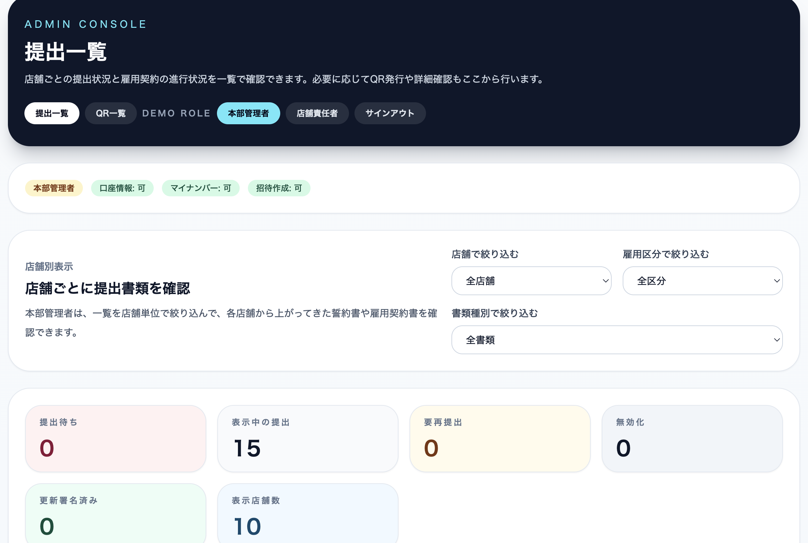
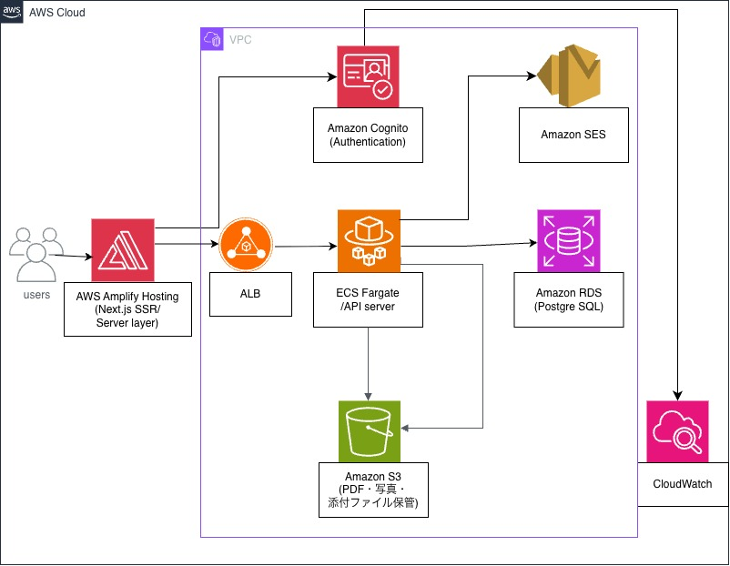
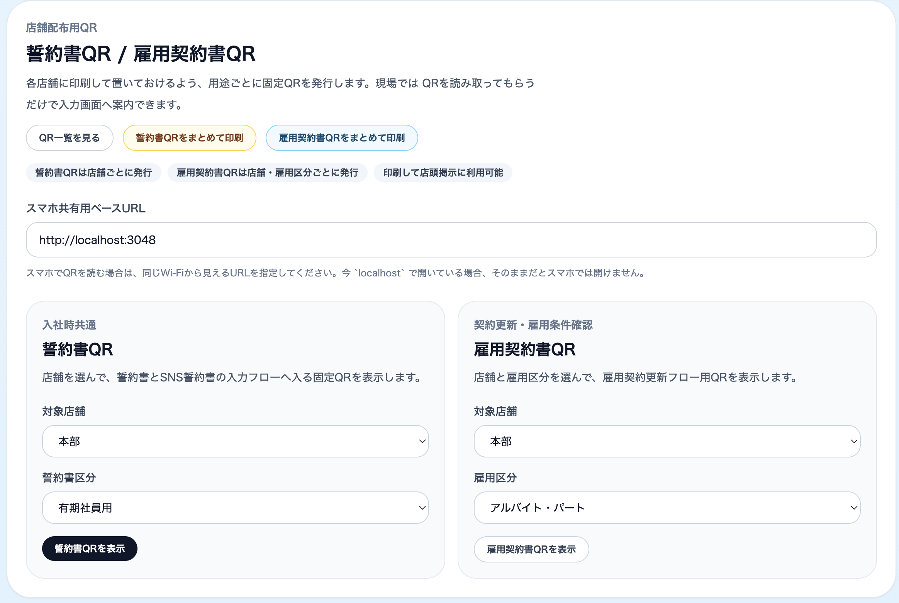
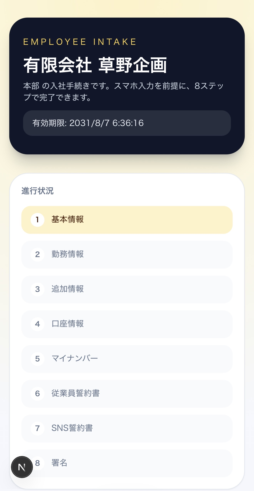
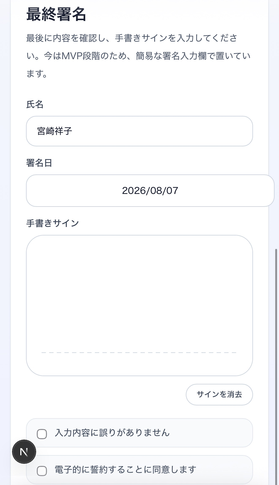

# QR対応 従業員書類管理システム

入社時に提出する **従業員誓約書**・**SNS誓約書** を電子化する社内向けシステムです。

紙で運用している契約書をスマートフォンから入力・署名でき、
管理者は提出状況を一覧で確認できます。

<p align="center">
  
</p>
---

## ✨ Features

- QRコードから契約書へアクセス
- スマホで電子署名
- 従業員情報の入力
- 誓約書・SNS誓約書の提出
- 管理画面で提出状況を一覧表示
- Prismaによるデータ管理

---

## 🏗️ Architecture

<p align="center">
  
</p>


---

## 🛠 Tech Stack

| Category | Technology |
|----------|------------|
| Frontend | Next.js 15 / React |
| Backend | Next.js Route Handlers |
| ORM | Prisma |
| Database | PostgreSQL |
| Styling | Tailwind CSS |
| Container | Docker |
| Language | TypeScript |

---

## 📂 Directory

```text
app/
components/
lib/
prisma/
public/
```

---

## 🚀 Setup

```bash
npm install
npm run prisma:generate
npm run dev
```

---

## 🐳 Docker

```bash
docker compose up --build
```

Mac

```
http://localhost:3048/admin/intakes?role=hq_admin
```

スマホ

```
http://<MacのIP>:3048
```

---

## 📱 Main Pages

| URL | Description |
|------|-------------|
| / | トップ |
| /intakes/:token | 契約入力 |
| /admin/intakes | 管理画面 |

---

## 📸 Screenshots

### 管理画面

<p align="center">
  
</p>

### 契約入力・電子署名

<p align="center">
  
  
</p>

---

## 📄 Documents

システムの企画背景や導入効果、AWS本番構成をまとめた企画提案書です。

- 📑 [企画提案書](./documents/Proposal.pdf)

## 🔮 Future Improvements

- AWS S3へPDF保存
- メール通知
- Amazon SES連携
- Cognito認証
- CloudFront配信
- 電子署名タイムスタンプ
- 監査ログ

---

## ⚠️ Current Status

- 管理者認証は仮実装
- PDF生成は未実装
- メール送信未実装
- S3保存未実装

紙で運用されている入社時契約書の管理を効率化することを目的として開発しました。

## 💡 Learning Points

このシステムを通して以下を学びました。

- Next.js App Router
- PrismaによるORM
- Docker Composeを利用した開発環境構築
- スマートフォンを利用したQRコード検証
- 将来的なAWS（S3・SES・Cognito）への拡張を考慮した設計